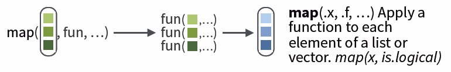

class: inverse, left, bottom
background-image: url(figs/lion.jpg)
background-size: cover

# Make your R roar by purrring
### Gavin Fay   
<br> __2020-04-07: UMassD Quantfish woRkshop__
<br>`r icon::fa("link")` [github.com/gavinfay/roar-with-purrr](https://github.com/gavinfay/roar-with-purrr)
<br> `r icon::fa("envelope")` [gfay@umassd.edu](gfay@umassd.edu)  `r icon::fa("twitter")` [gavin_fay](https://twitter.com/gavin_fay)

<!-- [default, metropolis, metropolis-fonts] -->
<!--    highlightStyle: atelier-lakeside-light -->


```{r setup, include=FALSE}
knitr::opts_chunk$set(echo = TRUE)
knitr::opts_chunk$set(prompt = FALSE)
options(htmltools.dir.version = FALSE)
library(tidymodels)
library(tidyverse)
#library(infer)
#devtools::install_github("gadenbuie/countdown")
library(countdown)
```
---

background-image: url(figs/logo.png)
background-position: 95% 5%
background-size: 10%

## Make your R roar with `purrr`

Google Doc containing links to today's resources:  
[link was here]("roar-with-purrr")

Add your name to attendance.  

Add notes/tips to googledoc to create shared learning resource.  

Use your own computer or RStudio Cloud machine  

These slides:
[gavinfay.github.io/roar-with-purrr/purrr-slides]("gavinfay.github.io/roar-with-purrr/purrr-slides")

My .Rmd updated live at:  
[https://github.com/gavinfay/roar-with-purrr]("https://github.com/gavinfay/roar-with-purrr")

__Acknowledgements:__  
[Dan Ovando]("https://twitter.com/DanOvand0"), 
[Maia Kapur]("https://twitter.com/KapurMaia"), 
[Mine Çetinkaya-Rundel]("https://twitter.com/minebocek"), 
[Alison Hill]("https://twitter.com/apreshill"), 
[Megsie Siple]("https://twitter.com/margaretsiple)

---

## Reducing code duplication

- Easier to see the intent of your code, eyes are drawn to what’s different, not what stays the same.  

- Easier to respond to changes, only need to make changes in one place, rather than every place you copied-and-pasted.  

- Likely to have fewer bugs because each line of code is used in more places.  

How? Iteration (today) & Functions  

---

## Iteration

When you need to do the same thing to multiple inputs: repeating the same operation on different columns, or on different datasets.  

Two main paradigms:  
1. imperative programming  
2. functional programming  


---

## Problem 1

We have data from several years of crab surveys.  

The data for each year is contained in separate ".csv" files.  

We would like to read these data into R, and combine them into a single data frame so we can inspect and plot them.  

---

## Problem 2  

We have data on Steller sea lion pup counts over time at a bunch of rookeries in Alaska.  

```{r out.width="60%", retina = 3, echo= FALSE}
knitr::include_graphics("figs/Slide5.png")
```

The number of data points for each rookery is not the same.  

We want to investigate the annual trend in counts for each rookery.  
We want to plot the slopes of the regressions using a histogram.  
We want to obtain confidence intervals of the slope estimates using bootstrapping.  


---

## Problem 3  

We are interested in creating a standardized time series of CPUE for a fishery, by 'removing' the effect of variables that affect catch rates such that we have an index of abundance.  
We have many possible variables.  
We would like to compare models that use different combinations of these variables.  

---

## Problem 4

Status for endangered species are often based on a risk evaluation of population projections.  
We want to project population dynamics forward in time given uncertainty in future dynamics.  
We want to do this lots of times to quantify the risk of extinction.  


---

## Familiar approaches?

--

### `for` / `while` loops ...
### `apply` functions (`apply()`, `tapply()`, `sapply()`, `lapply()`)  
### `aggregate()` ...
### `group_by() %>% summarize()` in `dplyr` ...

--

### `purrr` package is tidyverse solution.  

---

## Pivot tables & loops 


```{r comment='',collapse=TRUE,eval=FALSE}
for (i in unique(iris$Species)) {
  meanSepalLength <-
      mean(data[iris$Species==i,]$Sepal.Length)
  cat(i, meanSepalLength, "\n")
}
```

```{r eval=FALSE}
with(iris,tapply(Sepal.Length, Species, mean))   
```


```{r eval=FALSE}
aggregate(iris$Sepal.Length, by=list(iris$Species), mean)
```

```{r eval=FALSE}
iris %>% 
  group_by(Species) %>% 
  summarize(mean = mean(Sepal.Length))
```

---

## Common way to use loops  

```{r comment='',collapse=TRUE,eval=FALSE}
#define the elements to loop over
species <- sort(unique(iris$Species))

#define how many times to do the loop
nspecies <- length(species)

#create a place to store results
mean.lengths <- vector(length=nspecies)

#get loopy
for (i in 1:nspecies) {
  species.data <- iris[iris$Species==species[i], ]
  mean.lengths[i] <- mean(species.data$Sepal.Length) #<< 
  print(mean.lengths[i])
  cat("Running species ", i,"\n")
}
```

A lot of this code is book-keeping rather than the thing we want to do.  

---

background-image: url(figs/logo.png)
background-position: 0% 100%
background-size: 10%

## `purrr`

`for` loops are simple, but they require lots of code that is mostly book-keeping.  

Attention is then on this rather than the action the code is doing.  

Functional programming abstracts the book-keeping of the loop to keep attention on the code that matters.  

Series of `apply` functions in base R. (`apply`, `tapply`, `sapply`, `lapply`)  
These all have slight differences about how they are used.  

`purrr` package is the tidyverse solution to the apply functions.  

---

class: center, middle


---

background-image: url(figs/worldcat.jpg)
background-position: 50% 100%
background-size: 30%

## Basics of `purrr`

The `map` function is the workhorse of `purrr`.  
e.g. 
.pull-left[
```{r}
shades <- colors()[1:5]  
for (i in seq_along(shades)) { 
  print(shades[i])  
}
```
]

--

.pull-right[
```{r}
a <-  map(shades, print)  #<<
```
]

---

## `map`

Basic syntax:

```{r eval=FALSE}
map("Lists to apply function to",  #<<
    "Function to apply across lists",  #<<
    "Additional parameters")  #<<
```

`map` by default returns a list. However we can specify the type of output:  

`map_dbl` returns real numbers  
`map_lgl` returns logicals  
`map_chr` returns characters  
`map_int` returns integers  
`map_df`  returns a dataframe    



[cheatsheat: github.com/rstudio/cheatsheets/blob/master/purrr.pdf](https://github.com/rstudio/cheatsheets/blob/master/purrr.pdf)


---

## Shortcuts

```{r eval = FALSE}
models <- mtcars %>% 
  split(.$cyl) %>% 
  map(function(df) lm(mpg ~ wt, data = df)) #<<
```

The syntax for creating an anonymous function in R is quite verbose so purrr provides a convenient shortcut: a one-sided formula.  

```{r}
models <- mtcars %>% 
  split(.$cyl) %>%  
  map(~lm(mpg ~ wt, data = .))  #<<
  #The 1st ~ is shorthand for a function
  #The '.' shows where the stuff passed to map gets used.
```  

---

## Shortcuts 2

Extracting summary statistics

```{r eval=FALSE}
models %>%
  map(summary) %>% 
  map_dbl(pluck, "r.squared")
```

```{r eval=FALSE}
models %>%
  map(summary) %>% #run 'summary() for each model
  map_dbl(~.$r.squared) # find the R-squared
```

Extracting named components is a common operation, so can use a string instead.

```{r eval = FALSE, warning = FALSE}
models %>%
  map(summary) %>% #run 'summary() for each model
  map_dbl("r.squared") #find the R-squared 
```

---

## Exercise 1

Write code that uses one of the map functions to:  

a. Compute the mean of every column in `mtcars`.  
b. Determine the type of each column in `nycflights13::flights`.  
c. Compute the number of unique values in each column of `iris`.  

```{r echo = FALSE}
countdown(minutes = 5)
```

---

## Exercise 1

Write code that uses one of the map functions to:  

a. Compute the mean of every column in `mtcars`.  
```{r}
map_dbl(mtcars, mean)
```
b. Determine the type of each column in `nycflights13::flights`.  
```{r}
map_chr(nycflights13::flights, typeof)
```

---

## Exercise 1

Write code that uses one of the map functions to:  

c. Compute the number of unique values in each column of `iris`.  
```{r}
map_int(iris, ~length(unique(.)))
map_int(iris, n_distinct)
```

---

## Extending to multiple input lists

`map2` allows you to map over two sets of inputs.  

```{r eval=FALSE}
map2(list1, list2, ~function(.x,.y), ...)
```

e.g. generate 3 sets of 5 normal random variables, with the means & standard deviations different in each set.  
```{r}
mu <- list(5, 10, -3)
sigma <- list(1, 5, 10)
map2(mu, sigma, rnorm, n = 5) %>% str()
```


---

##  More than 2 inputs, use `pmap`

e.g. same problem as previous, but now n varies in each set.  

```{r}
n <- list(1, 3, 5)
mu <- list(5, 10, -3)
sigma <- list(1, 5, 10)

args1 <- list(mean = mu, sd = sigma, n = n)
args1 %>%
  pmap(rnorm) %>%  #<<
  str()
```

Safest to use named arguments with `pmap`, as it will do positional matching if not.  


---

## Debugging using `safely`

Handling errors can be tricky to diagnose with map.  
It's not as obvious when things break.  

Can use `safely()`. e.g.  

```{r}
safe_log <- safely(log, otherwise = NA_real_) #<<
#safe_log return a NA if log() returns error, plus error msg.  
list("a", 10, 100) %>%
  map(safe_log) %>%  #<<
  transpose() %>%
  simplify_all()
```

---

## `accumulate()`

We sometimes like to use the output of one iteration as input to the next.  

e.g. model population dynamics over time, iterated function is annual population update.  

$N_{t+1} = \lambda N_{t} - h_{t}$

Can achieve this using `accumulate()`.  

```{r out.width = "80%", echo = FALSE}
knitr::include_graphics("figs/accumulate.png")
```

---

## `accumulate()`

We sometimes like to use the output of one iteration as input to the next.  

e.g. model population dynamics over time, iterated function is annual population update.  

$N_{t+1} = \lambda N_{t} - h_{t}$

Can achieve this using `accumulate()`.  

```{r warning = FALSE}
pop_update <- function(N, h=0, lambda = 1.05) lambda*N - h
h <- rep(10,10)
initN <- 100
accumulate(h, pop_update, .init = initN, lambda = 1.05)
```

```{r, warning = FALSE}
accumulate(letters[1:10], paste, sep = "+")
```

---

## Crab example

We have data from several years of crab surveys with counts of _cancer_ & _carcinus_ crabs at numerous sites.      

The data for each year is contained in separate ".csv" files.  

We would like to read these data into R, and combine them into a single data frame so we can inspect and plot them.  
For example, we might be interested in the co-occurrence of the two crabs.  

---

## Crab example

```{r warning = FALSE, comment=FALSE, message=FALSE}
files <- dir(path = "data/crabs",
             pattern = "*.csv",
             full.names = TRUE)
files
```

---

## Crab example

```{r warning = FALSE, comment=FALSE, message=FALSE}
files <- dir(path = "data/crabs",
             pattern = "*.csv",
             full.names = TRUE)
#files
crab_data <- map_df(files, read_csv) %>%
  group_by(year, site) %>%
  I()
crab_data
```

---

## Crab example

.pull-left[
```{r crabs, warning = FALSE, comment=FALSE, message=FALSE, fig.show = 'hide'}
files <- dir(path = "data/crabs",
             pattern = "*.csv",
             full.names = TRUE)
#files
crab_data <- map_df(files, read_csv) %>%
  group_by(year, site) %>%
  I()
#crab_data
crab_plot <- ggplot(crab_data) +
  aes(x = carcinus,
      y = cancer,
      group = site) +
  geom_point() +
  facet_wrap(~site) +
  theme_minimal() +
  NULL
crab_plot
```
]

--

.pull-right[
```{r ref.label= 'crabs', echo = FALSE, retina = 3, message= FALSE}
```
]

.footnote[
data from [github.com/lockedata/datasauRus]("https://github.com/lockedata/datasauRus")
]

---

## Problem 2  

We have data on Steller sea lion pup counts over time at a bunch of rookeries in Alaska.  

```{r out.width="60%", retina = 3, echo= FALSE}
knitr::include_graphics("figs/Slide5.png")
```

The number of data points for each rookery is not the same.  

We want to investigate the annual trend in counts for each rookery.  
We want to plot the slopes of the regressions using a histogram.  
We want to obtain confidence intervals of the slope estimates using bootstrapping.  


---

### read in data and make it tidy

.pull-left[
```{r ssl1, warning = FALSE, results = 'hide', comment=FALSE, message=FALSE, fig.show = 'hide'}
ssl <- read_csv("data/SSLpupcounts.csv")
ssl_long <- ssl %>%
  pivot_longer(names_to = "year",  #<<
               values_to = "count",  #<<
               -sitename) %>%  #<<
  na.omit()
ssl_long
```
]

--

.pull-right[
```{r ref.label= 'ssl1', echo = FALSE, retina = 3, message= FALSE}
ssl_long
```
]

---

### Look at annual change in pup counts since 2000

.pull-left[
```{r ssl2, warning = FALSE, results = 'hide', comment=FALSE, message=FALSE, fig.show = 'hide'}
ssl_models <- ssl_long %>%
  group_by(sitename) %>%
  filter(count > 0,
         year >= 2000) %>%
  mutate(year2 = as.numeric(year)-2000,
         log_count = log(count)) %>%
  nest() %>%   #<<
  I()
ssl_models
```
]

--

.pull-right[
```{r ref.label= 'ssl2', echo = FALSE, retina = 3, message= FALSE}
ssl_models
```
]

`ssl_models` contains a row for each rookery, the `data` variable contains the dataset for each rookery.  

---

Use `map` to fit the model of `log(count)~year` for each of the elements in `data`.  
Then pull out the estimates for the slopes (rate of increase).  

```{r ssl3, warning = FALSE, results = 'hide', comment=FALSE, message=FALSE, fig.show = 'hide'}
ssl_models <- ssl_long %>%
  group_by(sitename) %>%
  filter(count > 0,
         year >= 2000) %>%
  mutate(year2 = as.numeric(year)-2000,
         log_count = log(count)) %>%
  nest() %>%
  mutate(model = map(data, ~lm(log_count ~ year2, data = .))) %>% #<<
  mutate(coef = map(model, coef), #<<
         slope = map_dbl(coef, pluck, 2)) %>% #<<
  I()
ssl_models
```

```{r ref.label= 'ssl3', echo = FALSE, retina = 3, message= FALSE}
ssl_models
```

---

Plot the estimates for the rates of increase (slopes).  

.pull-left[
```{r ssl4, warning = FALSE, comment=FALSE, message=FALSE, fig.show = 'hide'}
ssl_models <- ssl_long %>%
  group_by(sitename) %>%
  filter(count > 0,
         year >= 2000) %>%
  mutate(year2 = as.numeric(year)-2000,
         log_count = log(count)) %>%
  nest() %>%
  mutate(model = map(data, ~lm(log_count ~ year2, data = .))) %>% 
  mutate(coef = map(model, coef),
         slope = map_dbl(coef, pluck, 2)) %>% 
  I()
ssl_models %>%
  ggplot() +
  aes(x = fct_reorder(sitename, slope), y = slope) +
  geom_point() +
  coord_flip() +
  NULL
```
]

.pull-right[
```{r ref.label= 'ssl4', echo = FALSE, retina = 3, message= FALSE}
```
]

Pup production increasing at many sites but declining at some.  
(some sites have very few counts)  

.footnote[
data from [NOAA Fisheries National Marine Mammal Lab]("https://www.fisheries.noaa.gov/alaska/marine-mammal-protection/steller-sea-lion-data")
]
---

We want to obtain confidence intervals of the slope estimates by performing residual bootstrapping.  
Instead of resampling the data (which would destroy the relationship with year), we resample the residuals from the initial models.  

```{r}
nboot <- 100
# first extract a table of fitted values and residuals using augment
ssl_boot <- ssl_models %>%
  mutate(tbl = map(model, broom::augment)) %>% 
  select(sitename, tbl) %>% 
  unnest(cols=c(tbl)) %>% 
  rename("resid" = ".resid") %>% 
  I()
ssl_boot
```

---

We'll do resampling from the residuals for each year within each rookery.  
Rather than getting complicated with uber-nested lists, we'll use `sample_frac()` to do the resamples.  

```{r}
tosample <- ssl_boot %>% 
  select(sitename, resid) %>% 
  group_by(sitename)
tosample
```

---

We'll do resampling from the residuals for each year within each rookery.  
Rather than getting complicated with uber-nested lists, we'll use `sample_frac()` to do the resamples.  

```{r}
tosample <- ssl_boot %>% 
  select(sitename, resid) %>% 
  group_by(sitename)
#tosample
resamples <-
   map_dfr(seq_len(nboot),~sample_frac(tosample, size = 1, replace = TRUE)) %>% #<<
   ungroup() %>% 
   mutate(replicate = rep(1:nboot, each = nrow(tosample)))
resamples
```

---

`resamples` contains our bootstraps.  
Let's append them to the data frame so we can compute the new data and re-fit the models for each case.  

```{r}
ssl_bootmod <- map_dfr(seq_len(nboot), ~I(ssl_boot)) %>%  #<<
  select(-resid) %>% 
  bind_cols(resamples) %>%  #<<
  mutate(log_count = .fitted + resid) %>% 
  group_by(sitename, replicate) %>% 
  nest() 
ssl_bootmod
```

We now have a data frame with a row for each site & replicate

---

We now have a data frame with a row for each site & replicate.  
We can use the same code as before to fit the (5,300) models.  

```{r}
ssl_bootmod <- map_dfr(seq_len(nboot), ~I(ssl_boot)) %>%  
  select(-resid) %>% 
  bind_cols(resamples) %>% 
  mutate(log_count = .fitted + resid) %>% 
  group_by(sitename, replicate) %>% 
  nest() %>%  
  mutate(model = map(data, ~lm(log_count ~ year2, data = .))) %>%  #<<
  mutate(coef = map(model, coef)) %>%  #<<
  mutate(slope = map_dbl(coef, pluck, 2)) %>%  #<<
    ungroup()
```

---

We now have a data frame with a row for each site & replicate.  
We can use the same code as before to fit the (5,300) models.  

```{r}
ssl_bootmod <- map_dfr(seq_len(nboot), ~I(ssl_boot)) %>%  
  select(-resid) %>% 
  bind_cols(resamples) %>%  
  mutate(log_count = .fitted + resid) %>% 
  group_by(sitename, replicate) %>% 
  nest() %>%  
  mutate(model = map(data, ~lm(log_count ~ year2, data = .))) %>% 
  mutate(coef = map(model, coef)) %>%  
  mutate(slope = map_dbl(coef, pluck, 2)) %>%  
    ungroup() %>% 
  group_by(sitename) %>%    #<<
  mutate(med = median(slope), #<<
         lower = quantile(slope, 0.025), #<<
         upper = quantile(slope, 0.975)) %>%  #<<
  I()
ssl_bootmod
```

---


Now plot summaries of the bootstrapped estimates for the slopes.    
Intervals are the distribution of 100 estimates of the slope for each rookery.   

.pull-left[
```{r boot1, warning = FALSE, comment=FALSE, message=FALSE, fig.show = 'hide'}
ssl_bootmod <- map_dfr(seq_len(nboot), ~I(ssl_boot)) %>%  
  select(-resid) %>% 
  bind_cols(resamples) %>%  
  mutate(log_count = .fitted + resid) %>% 
  group_by(sitename, replicate) %>% 
  nest() %>%  
  mutate(model = map(data, ~lm(log_count ~ year2, data = .))) %>% 
  mutate(coef = map(model, coef)) %>%  
  mutate(slope = map_dbl(coef, pluck, 2)) %>%  
    ungroup() %>% 
  group_by(sitename) %>%    
  mutate(med = median(slope), 
         lower = quantile(slope, 0.025), 
         upper = quantile(slope, 0.975)) %>%  
  I()
p1 <- ggplot(ssl_bootmod) +
  aes(x = fct_reorder(sitename, med), y = med) +  #<<
  geom_point() +
  geom_errorbar(aes(ymin=lower, ymax=upper), width= 0.2) + #<<
  coord_flip() +
  theme_minimal() +
  labs(y = "slope",
       x = "") +
  NULL
p1
```
]

.pull-right[
```{r ref.label= 'boot1', echo = FALSE, retina = 3, message= FALSE}
```
]


---

### Problem 3: Fishery CPUE  

We are interested in creating a standardized time series of CPUE for a fishery, by 'removing' the effect of variables that affect catch rates such that we have an index of abundance.  
Want to compare models that use different combinations of these variables.  
Let's look at NMFS Northeast US spring bottom trawl survey data for black sea bass.  
We'll fit a few GAMs of catch per tow with different numbers of covariates.  

.pull-left[
```{r bsb, warning = FALSE, results = 'hide', comment=FALSE, message=FALSE, fig.show = 'hide'}
bsb <- read_csv("data/neus_bts.csv") %>% 
  filter(comname == "BLACK SEA BASS",
         biomass > 0,
         season == "SPRING")
bsb
```
]

.pull-right[
```{r ref.label= 'bsb', echo = FALSE, retina = 3, message= FALSE}
bsb
```
]

.footnote[
data from [https://oceanadapt.rutgers.edu/]("https://oceanadapt.rutgers.edu/")
]

---

First make a list of model formulae using `accumulate()`  

```{r}
terms <- rev(names(bsb)[c(5:8)])
parts <- str_c("s(",terms,")")
forms <- map(accumulate(parts, 
                        paste, 
                        sep = " + ", 
                        .init = "log(biomass) ~ factor(year)"),
             as.formula)
forms
```

---

Use `modelr::fitwith()` to fit `gam()` for each formula

.pull-left[
```{r}
bsb_gams <- enframe(forms, name = "id", 
                    value = "formula") %>%
  mutate(model = modelr::fit_with(bsb, 
                                  mgcv::gam, 
                                  .formulas = forms),
         aic = map_dbl(model, AIC),
         p1 = map(model, gratia::draw))
bsb_gams
```
]

--

.pull-right[
```{r}
best_gam <- bsb_gams %>% 
  slice(which.min(bsb_gams$aic))
print(best_gam$p1)
```
]

---

### Problem 4: Population Viability Analysis

Status for endangered species are often based on a risk evaluation of population projections.  

We want to project population dynamics forward in time given uncertainty in future dynamics.  

We want to do this lots of times to quantify the risk of extinction.  

Initial population size is 7500, declines at 2% per year but there is annual (lognormal) process error with std. deviation 0.1    

i.e.
$N_{t+1} = \lambda N_{t} e^{\epsilon_{t}}$  

$\epsilon_t \sim N(0,\sigma_{\epsilon}^2)$

---

```{r}
nsim <- 100
nyr <- 100
lambda = 0.98
sd_proc <- 0.1
initN <- 7500
# create our list of time series for the process errors
errors <- map(seq_len(nsim), ~rnorm(nyr,0,sd_proc))

# population model
pop_update <- function(N, proc_err, lambda = 1.05) lambda*N*exp(proc_err)

# population projection for each time series of process errors
pop_proj <- map(errors,~accumulate(., pop_update, .init = initN, lambda = lambda)) %>% 
  enframe() %>% 
  rename(replicate = name) %>%
  mutate(final_n = map_dbl(value, pluck, nyr+1),
         drops_below_500 = map_lgl(value, ~any(.<500)))
p500 <- sum(pop_proj$drops_below_500)/nsim
p500
pop_proj
```


