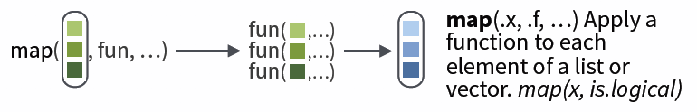
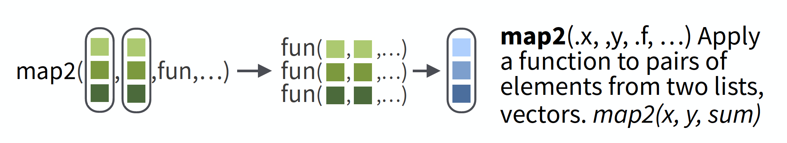
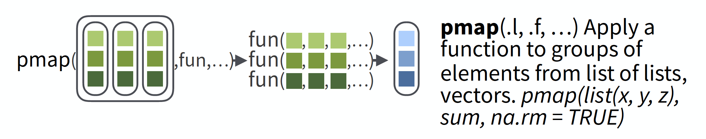

# Make your R roar by purrring
### Gavin Fay   
<br> __2020-04-07: UMassD Quantfish woRkshop__
<br>`r icon::fa("link")` [github.com/thefaylab/roar-with-purrr](https://github.com/thefaylab/roar-with-purrr)
<br> `r icon::fa("envelope")` [gfay@umassd.edu](gfay@umassd.edu)  `r icon::fa("twitter")` [gavin_fay](https://twitter.com/gavin_fay)


```{r setup, include=FALSE}
knitr::opts_chunk$set(echo = TRUE)
knitr::opts_chunk$set(prompt = FALSE)
options(htmltools.dir.version = FALSE)
library(tidyverse)
#devtools::install_github("gadenbuie/countdown")
library(countdown)
```
---


## Make your R roar with `purrr`

__Acknowledgements:__  
[Dan Ovando]("https://twitter.com/DanOvand0"), 
[Maia Kapur]("https://twitter.com/KapurMaia"), 
[Mine Çetinkaya-Rundel]("https://twitter.com/minebocek"), 
[Alison Hill]("https://twitter.com/apreshill")
[Alison Hill]("https://twitter.com/margaretsiple")


## Pivot tables & loops 


```{r comment='',collapse=TRUE,eval=FALSE}
for (i in unique(iris$Species)) {
  meanSepalLength <-
      mean(data[iris$Species==i,]$Sepal.Length)
  cat(i, meanSepalLength, "\n")
}
```

```{r eval=FALSE}
with(iris,tapply(Sepal.Length, Species, mean))   
```


```{r eval=FALSE}
aggregate(iris$Sepal.Length, by=list(iris$Species), mean)
```

```{r eval=FALSE}
iris %>% 
  group_by(Species) %>% 
  summarize(mean = mean(Sepal.Length))
```


## Common way to use loops  

```{r comment='',collapse=TRUE,eval=FALSE}
#define the elements to loop over
species <- sort(unique(iris$Species))

#define how many times to do the loop
nspecies <- length(species)

#create a place to store results
mean.lengths <- vector(length=nspecies)

#get loopy
for (i in 1:nspecies) {
  species.data <- iris[iris$Species==species[i], ]
  mean.lengths[i] <- mean(species.data$Sepal.Length) #<< 
  print(mean.lengths[i])
  cat("Running species ", i,"\n")
}
```

A lot of this code is book-keeping rather than the thing we want to do.  


## Basics of `purrr`

The `map` function is the workhorse of `purrr`.  
e.g. 
```{r}
shades <- colors()[1:5]  
for (i in seq_along(shades)) { 
  print(shades[i])  
}
```

```{r}
a <-  map(shades, print)  #<<
```


## `map`

Basic syntax:

```{r eval=FALSE}
map("Lists to apply function to",  #<<
    "Function to apply across lists",  #<<
    "Additional parameters")  #<<
```

`map` by default returns a list. However we can specify the type of output:  

`map_dbl` returns real numbers  
`map_lgl` returns logicals  
`map_chr` returns characters  
`map_int` returns integers  
`map_df`  returns a dataframe    



[cheatsheat: github.com/rstudio/cheatsheets/blob/master/purrr.pdf](https://github.com/rstudio/cheatsheets/blob/master/purrr.pdf)


## Shortcuts

```{r eval = FALSE}
models <- mtcars %>% 
  split(.$cyl) %>% 
  map(function(df) lm(mpg ~ wt, data = df)) #<<
```

The syntax for creating an anonymous function in R is quite verbose so purrr provides a convenient shortcut: a one-sided formula.  

```{r}
models <- mtcars %>% 
  split(.$cyl) %>%  
  map(~lm(mpg ~ wt, data = .))  #<<
  #The 1st ~ is shorthand for a function
  #The '.' shows where the stuff passed to map gets used.
```  


## Shortcuts 2

Extracting summary statistics

```{r eval=FALSE}
models %>%
  map(summary) %>% 
  map_dbl(pluck, "r.squared")
```

```{r eval=FALSE}
models %>%
  map(summary) %>% #run 'summary() for each model
  map_dbl(~.$r.squared) # find the R-squared
```

Extracting named components is a common operation, so can use a string instead.

```{r eval = FALSE, warning = FALSE}
models %>%
  map(summary) %>% #run 'summary() for each model
  map_dbl("r.squared") #find the R-squared 
```


## Exercise 1

Write code that uses one of the map functions to:  

a. Compute the mean of every column in `mtcars`.  
```{r}
map_dbl(mtcars, mean)
```
b. Determine the type of each column in `nycflights13::flights`.  
```{r}
map_chr(nycflights13::flights, typeof)
```

c. Compute the number of unique values in each column of `iris`.  
```{r}
map_int(iris, ~length(unique(.)))
map_int(iris, n_distinct)
```


```{r, }
countdown(minutes = 5)
```


## Extending to multiple input lists

`map2` allows you to map over two sets of inputs.  

```{r eval=FALSE}
map2(list1, list2, ~function(.x,.y), ...)
```

e.g. generate 3 sets of 5 normal random variables, with the means & standard deviations different in each set.  
```{r}
mu <- list(5, 10, -3)
sigma <- list(1, 5, 10)
map2(mu, sigma, rnorm, n = 5) %>% str()
```




##  More than 2 inputs, use `pmap`

e.g. same problem as previous, but now n varies in each set.  

```{r}
n <- list(1, 3, 5)
mu <- list(5, 10, -3)
sigma <- list(1, 5, 10)

args1 <- list(mean = mu, sd = sigma, n = n)
args1 %>%
  pmap(rnorm) %>%  #<<
  str()
```

Safest to use named arguments with `pmap`, as it will do positional matching if not.  




## Debugging using `safely`

Handling errors can be tricky to diagnose with map.  
It's not as obvious when things break.  

Can use `safely()`. e.g.  

```{r}
safe_log <- safely(log, otherwise = NA_real_) #<<
#safe_log return a NA if log() returns error, plus error msg.  
list("a", 10, 100) %>%
  map(safe_log) %>%  #<<
  transpose() %>%
  simplify_all()
```


## `accumulate()`

We sometimes like to use the output of one iteration as input to the next.  

e.g. model population dynamics over time, iterated function is annual population update.  

$N_{t+1} = \lambda N_{t} - h_{t}$

Can achieve this using `accumulate()`.  

```{r warning = FALSE}
pop_update <- function(N, h=0, lambda = 1.05) lambda*N - h
h <- rep(10,10)
initN <- 100
accumulate(h, pop_update, .init = initN, lambda = 1.05)
```

```{r, warning = FALSE}
accumulate(letters[1:10], paste, sep = "+")
```


## Crab example, switch to RStudio

We have data from several years of crab surveys.  

The data for each year is contained in separate ".csv" files.  

We would like to read these data into R, and combine them into a single data frame so we can inspect and plot them.  


```{r crabs, warning = FALSE, comment=FALSE, message=FALSE}
files <- dir(path = "data/crabs", 
             pattern = "*.csv", 
             full.names = TRUE)
#files
crab_data <- map_df(files, read_csv) %>% 
  group_by(year, site) %>%
  I()
#crab_data
crab_plot <- ggplot(crab_data) +
  aes(x = carcinus, 
      y = cancer, 
      group = site) +
  geom_point() +
  facet_wrap(~site) +
  theme_minimal() +
  NULL
crab_plot
```


## Problem 2  

We have data on Steller sea lion pup counts over time at a bunch of rookeries in Alaska.  

```{r out.width="60%", retina = 3, echo= FALSE}
knitr::include_graphics("figs/04_transfoRm/Slide5.png")
```

The number of data points for each rookery is not the same.  

We want to investigate the annual trend in counts for each rookery.  
We want to plot the slopes of the regressions using a histogram.  
We want to obtain confidence intervals of the slope estimates using bootstrapping.  


---

```{r}
ssl <- read_csv("data/SSLpupcounts.csv")
ssl
ssl_long <- ssl %>% 
  pivot_longer(names_to = "year",
               values_to = "count",
               -sitename) %>% 
  na.omit()
ssl_long

ssl_models <- ssl_long %>% 
  mutate(year = as.numeric(year)) %>% 
  filter(year >= 2000,
         count > 0) %>%
  mutate(log_count = log(count),
         year2 = year-2000) %>% 
#  I()
#ssl_models 
  group_by(sitename) %>% 
  nest() %>% 
  mutate(model = map(data, ~lm(log_count ~ year2, data = .))) %>% 
  mutate(coef = map(model, coef)) %>% 
  mutate(slope = map_dbl(coef, pluck, 2)) %>% 
  I()
ssl_models
ssl_models$model[[1]]
  #lm(log_count ~ year2, data = ssl_models)

ggplot(ssl_models) +
  aes(x = slope) +
  geom_histogram(col="white") +
  theme_minimal()

ggplot(ssl_models) +
  aes(x = fct_reorder(sitename, slope), y= slope) +
  geom_point() +
  coord_flip() +
  theme_minimal()

```

## residual bootstrapping

```{r}
#system.time({
nboot <- 100
ssl_boot <- ssl_models %>%
  mutate(tbl = map(model, broom::augment)) %>% 
  select(sitename, tbl) %>% 
  unnest(cols=c(tbl)) %>% 
  rename("resid" = ".resid") %>% 
  I()
tosample <- ssl_boot %>% 
  select(sitename, resid) %>% 
  group_by(sitename)
resamples <-
   map_dfr(seq_len(nboot),~sample_frac(tosample, size = 1, replace = TRUE)) %>%
   ungroup() %>% 
   mutate(replicate = rep(1:nboot, each = nrow(tosample)))
resamples
ssl_boot <- ssl_boot %>% 
  ungroup() %>% 
  map_df(seq_len(nboot),~I(.))
ssl_boot

```


## Problem 3  

We are interested in creating a standardized time series of CPUE for a fishery, by 'removing' the effect of variables that affect catch rates such that we have an index of abundance.  

We have many possible variables.  

We would like to compare models that use different combinations of these variables.  


```{r}

bsb <- read_csv("data/neus_bts.csv") %>% 
  filter(comname == "BLACK SEA BASS",
         biomass > 0,
         season == "SPRING")
bsb
```


## Problem 4

Status for endangered species are often based on a risk evaluation of population projections.  

We want to project population dynamics forward in time given uncertainty in future dynamics.  

We want to do this lots of times to quantify the risk of extinction.  

```{r}
nsim <- 10
nyr <- 100
sd_proc <- 0.1
initN <- 7500
```
